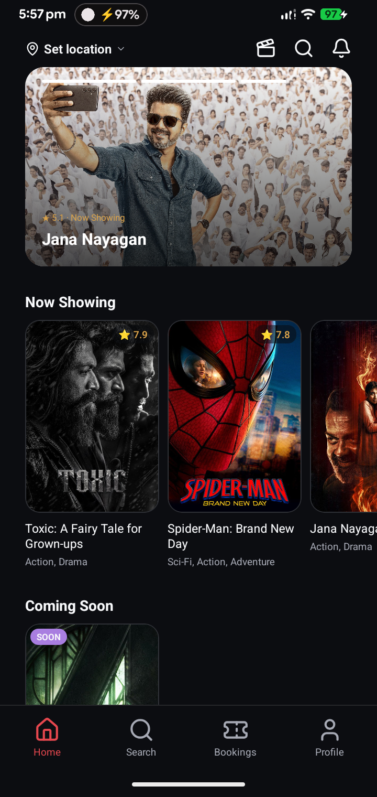
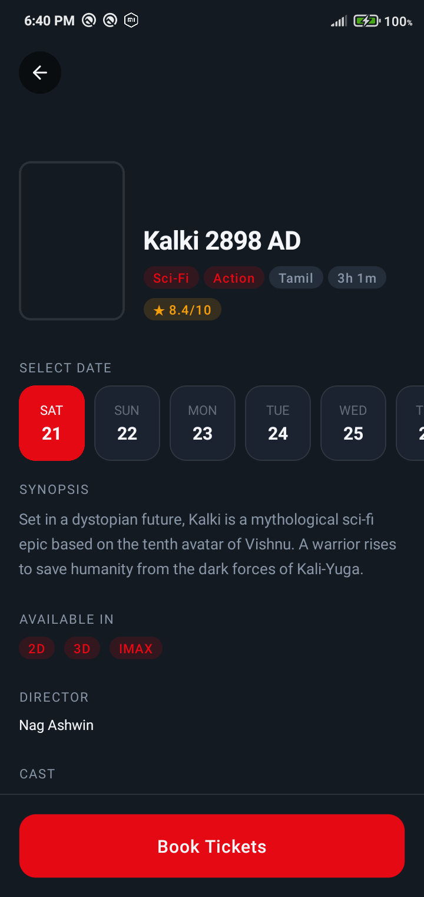
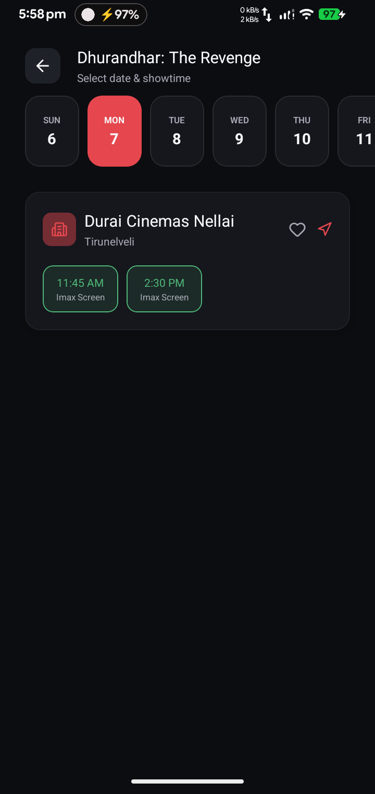
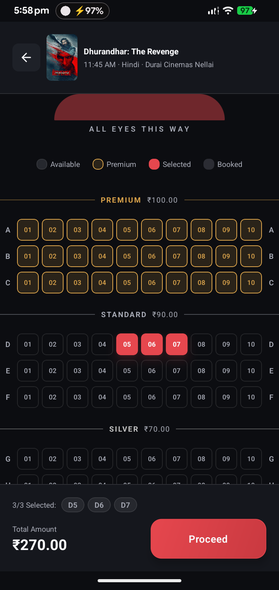
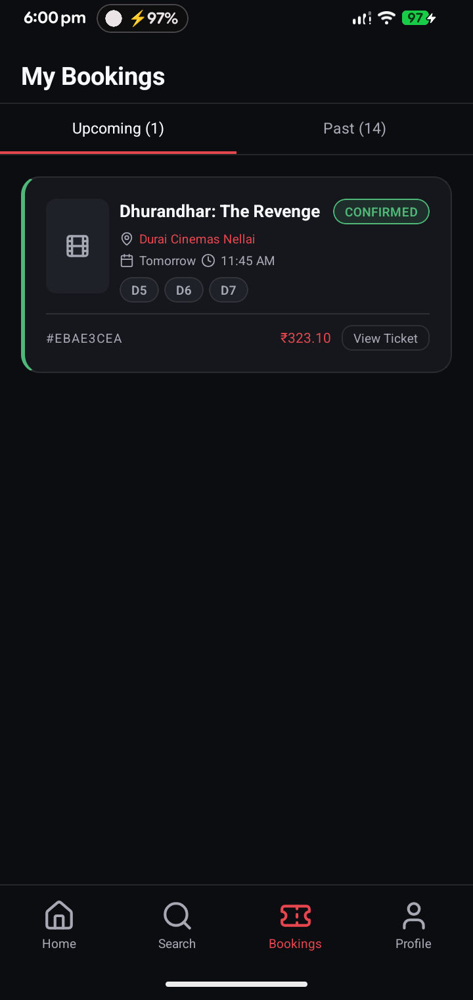
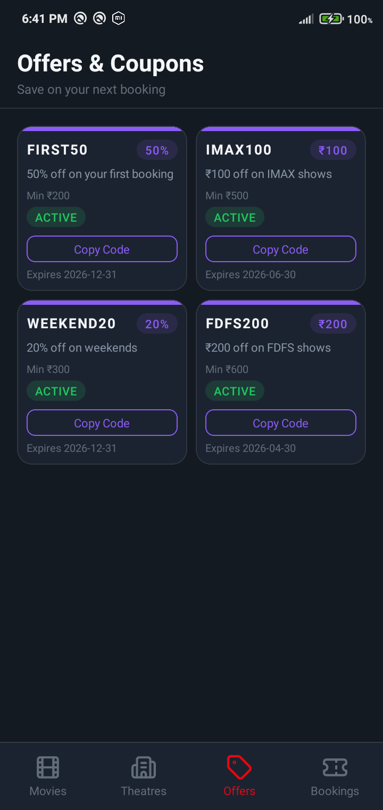
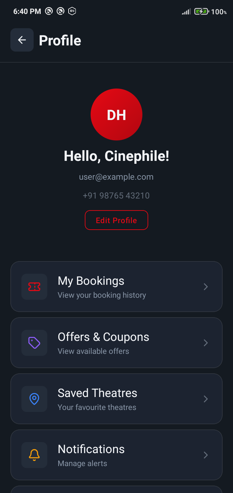
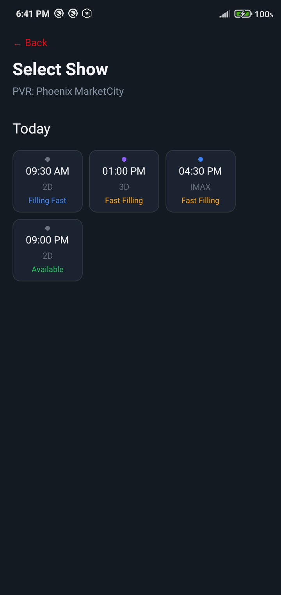

<div align="center">

# 🎬 CineHall

**A production-grade React Native cinema ticket booking app**

[](https://reactnative.dev)
[](https://www.typescriptlang.org)
[](#quick-start)
[](LICENSE)
[](#contributing)

Feature-sliced architecture · dual dark/light theme · real backend integration

</div>

---

CineHall is a full end-to-end mobile port of a cinema ticket booking web app, built with **React Native (New Architecture)** and **TypeScript**. It integrates against a real Express/Postgres/Razorpay backend ([`cinema-hall-api`](../../cinema-hall/cinema-hall-api)) and is functionally equivalent to the web client ([`cinema-hall-users`](../../cinema-hall/cinema-hall-users)) it was ported from.

> UI and content originate from the **CineHall** design (`CineHall.dc.html`, a claude.ai/design prototype) — a 15-screen mobile UI kit covering onboarding, auth, discovery, booking, and account flows, with an in-app dark/light theme toggle.

## Table of Contents

- [Features](#features)
- [Screenshots](#screenshots)
- [Tech Stack](#tech-stack)
- [App Flow](#app-flow)
- [Quick Start](#quick-start)
- [Project Structure](#project-structure)
- [Environment Configuration](#environment-configuration)
- [Path Aliases](#path-aliases)
- [Design System](#design-system)
- [Documentation](#documentation)
- [Scripts](#scripts)
- [Key Design Decisions](#key-design-decisions)
- [Contributing](#contributing)
- [License](#license)

## Features

- 🎟️ **End-to-end booking flow** — browse, pick a showtime, select seats on a real per-theatre layout, pay, and get a QR-coded ticket
- 🌗 **Dark/light theme** — every screen is theme-aware, toggled from Profile and persisted across launches
- 🔓 **Auth-optional browsing** — sign-in is only requested when it matters (checkout, bookings, profile), mirroring the web app's UX
- 💳 **Real Razorpay checkout** — hosted in a WebView, bridged back to the app via `postMessage`, with server-authoritative seat holds
- 📍 **Location-aware discovery** — GPS or manual district/state selection, cached for 24h
- 🔍 **Debounced search** with persisted recent queries
- 🎫 **Saveable tickets** — QR ticket screenshot saved to the camera roll
- 🧪 **Mock-first development** — every service has an in-memory mock fallback (`Env.USE_MOCKS`), so UI work never blocks on a running backend

## Screenshots

<div align="center">
<table>
<tr>
<td></td>
<td></td>
<td></td>
<td></td>
</tr>
<tr>
<td align="center">Home</td>
<td align="center">Movie Details</td>
<td align="center">Showtimes</td>
<td align="center">Seat Selection</td>
</tr>
<tr>
<td></td>
<td></td>
<td></td>
<td></td>
</tr>
<tr>
<td align="center">My Bookings</td>
<td align="center">Offers</td>
<td align="center">Profile</td>
<td align="center">Theatres</td>
</tr>
</table>
</div>

## Tech Stack

| Layer | Technology |
|---|---|
| Framework | React Native 0.84.1 (New Architecture / Fabric) |
| Language | TypeScript 5.8 |
| Navigation | React Navigation v7 (Native Stack + Bottom Tabs) |
| State Management | Zustand v5 (+ `persist` for theme/auth/location) |
| HTTP | Native `fetch`, wrapped by a custom `httpClient` (no axios) |
| Env config | `react-native-config` — `.env` / `.env.staging` / `.env.production` |
| Animations | React Native `Animated` API + Reanimated (seat map pinch/pan zoom) |
| Gestures | React Native Gesture Handler v2 |
| Storage | `@react-native-async-storage/async-storage` (theme, auth tokens, location cache, favourites) |
| Payments | Razorpay Checkout, hosted in a `react-native-webview` |
| Auth | Email/password + Google Sign-In (`@react-native-google-signin/google-signin`), Bearer JWT |
| Location | `@react-native-community/geolocation` + BigDataCloud reverse geocoding |
| Icons | lucide-react-native + react-native-svg |
| Gradients | react-native-linear-gradient |
| QR Codes | react-native-qrcode-svg + react-native-svg |
| Ticket save | react-native-view-shot + `@react-native-camera-roll/camera-roll` |
| Clipboard | `@react-native-clipboard/clipboard` (offer code copy) |
| Runtime | Hermes JS Engine |

## App Flow

```
Splash → Onboarding → MainTabs (browsing is public — auth is optional here)
                                       │
                    ┌──────────────────┼───────────────────┐
                    ▼                  ▼                   ▼
                Search Tab       Bookings Tab          Profile Tab
              (public)          (login required)     (login-gated menu)

Home → Movie Details → Showtimes → Seat Selection → Checkout → Payment
                                                                    │
                                                        Razorpay WebView checkout
                                                                    │
                                                    ┌───────────────┴───────────────┐
                                                    ▼                               ▼
                                          Booking Confirmed                 Booking Failed
                                     (fetches ticket by payment_id)   (hold kept alive, Try Again)
```

Login is not the app's entry point — the web app's model of "browse freely, sign in only when it matters" is mirrored via `useRequireAuth()`, which pushes `Login` as a modal only when Proceed-to-pay, My Bookings, or Profile actions need a session.

## Quick Start

### Prerequisites

- Node.js >= 22.11.0
- React Native development environment ([setup guide](https://reactnative.dev/docs/set-up-your-environment))
- Android Studio (for Android) or Xcode (for iOS)
- `cinema-hall-api` running locally (see that repo's README) — or point `.env` at a deployed instance

### Installation

```bash
# 1. Clone the repo
git clone https://github.com/hduraimurugan/ciemax-app.git
cd ciemax-app

# 2. Install JS dependencies
npm install

# 3. iOS only — install native pods
cd ios && pod install && cd ..

# 4. Configure environment
cp .env.example .env
# edit .env — at minimum set API_BASE_URL (see the file's comments for the
# emulator/device/simulator host cheatsheet) and GOOGLE_WEB_CLIENT_ID
```

### Running the App

```bash
# Start Metro bundler
npm start

# Run on Android (new terminal). On a *physical* device, first run
# `adb reverse tcp:5000 tcp:5000` so the phone can reach the local API —
# see docs/android-dev-device.md
npm run android

# Run on iOS (new terminal) — see docs/ios-env-setup.md for one-time
# react-native-config / Google Sign-In Xcode setup, done on a Mac
npm run ios
```

### Reset Metro cache

Required after changing `babel.config.js`, `tsconfig.json`, `metro.config.js`, or adding native packages:

```bash
npm start -- --reset-cache
```

> `lucide-react-native` requires `metro.config.js` to set `resolver.unstable_enablePackageExports: false`. Without this, Metro picks up the ESM build which Hermes cannot process. See [`metro.config.js`](metro.config.js) and [`docs/design-system.md`](docs/design-system.md#icons) for details.

## Project Structure

```
MyApp/
├── App.tsx                        # Root: GestureHandlerRootView > SafeAreaProvider > NavigationContainer
├── .env.example                   # Documented env keys — copy to .env / .env.staging / .env.production
├── index.js
├── src/
│   ├── app/navigation/            # RootNavigator (Stack) + TabNavigator (Bottom Tabs)
│   ├── constants/
│   │   ├── theme.ts               # Design tokens: DarkColors/LightColors, Spacing, Radius, FontSize, Shadow
│   │   ├── config.ts              # App-level config (seat cap, StorageKeys, mock SeatPricing)
│   │   └── env.ts                 # Typed react-native-config wrapper — Env.API_BASE_URL etc.
│   ├── types/
│   │   ├── models.ts              # App-facing camelCase domain types (Movie, Seat, Booking, ...)
│   │   ├── api.ts                 # Exact snake_case cinema-hall-api DTOs + ApiError
│   │   └── navigation.ts          # RootStackParamList, TabParamList, CheckoutParams
│   ├── store/
│   │   ├── authStore.ts           # Zustand + persist — tokens, customer, bootstrap/login/logout
│   │   ├── locationStore.ts       # Zustand + persist — district/state, 24h GPS cache
│   │   ├── bookingStore.ts        # Zustand — in-progress seat selection (pre-hold only)
│   │   └── themeStore.ts          # Zustand + persist — dark/light mode
│   ├── services/                  # Real API layer — httpClient.ts + one file per domain
│   │   ├── httpClient.ts          # fetch wrapper: error normalization, refresh-on-401/403
│   │   ├── mappers.ts             # DTO (api.ts) -> app model (models.ts) conversions
│   │   ├── authService.ts, moviesService.ts, theatresService.ts, showsService.ts,
│   │   │   seatsService.ts, bookingService.ts, paymentService.ts, offersService.ts,
│   │   │   settingsService.ts, adsService.ts
│   │   └── *.mock.ts              # Original in-memory mocks, still usable via Env.USE_MOCKS
│   ├── hooks/                     # Data-fetching hooks (loading/error/refetch) + useRequireAuth, useFavourites
│   ├── shared/
│   │   ├── ui/                    # Design system components — all theme-aware
│   │   └── utils/formatters.ts
│   └── features/                  # Domain-based feature modules (self-contained)
│       ├── onboarding/            # SplashScreen (waits for auth bootstrap), OnboardingScreen
│       ├── auth/                  # Login, Register+OTP, ForgotPassword, Google Sign-In
│       ├── location/              # LocationModal — GPS detect or manual state/district pick
│       ├── movies/                # MoviesScreen (Home), MovieDetailScreen
│       ├── search/                # SearchScreen — debounced, persisted recent searches
│       ├── theatres/               # ShowtimesScreen (per movie), TheatresScreen (hall -> movies -> shows)
│       ├── seats/                 # Real seat map: SeatGrid (pinch/pan), SeatCountModal, seatSelection.ts
│       ├── booking/                # Checkout, Payment, RazorpayWebView, BookingSuccess/Failure
│       ├── profile/                # Profile, MyBookings, TicketDetail, ChangePassword, SetPassword
│       └── offers/                 # OffersScreen — real coupons, clipboard copy
├── android/app/build.gradle       # react-native-config wired to per-variant .env files
├── docs/
│   ├── ios-env-setup.md           # Manual Xcode steps for react-native-config + Google Sign-In (Mac-only)
│   └── android-dev-device.md      # Local API access from a physical Android device (adb reverse / LAN IP) + Google Sign-In debug-keystore SHA-1 setup
└── __mocks__/                     # Jest manual mocks for every native module the app touches
```

## Environment Configuration

Every API host, feature flag, and OAuth client ID is read from `Env` (`src/constants/env.ts`), backed by `react-native-config`. See [`.env.example`](.env.example) for the full documented key list. Nothing in `.env*` is secret by the time it ships — it's baked into the compiled app the same way the APK/IPA itself is public. Server secrets (JWT signing keys, Razorpay `key_secret`, DB credentials) live only in `cinema-hall-api`'s own `.env` and never appear here.

`Env.USE_MOCKS=true` switches every service back to its original in-memory mock implementation (`src/services/*.mock.ts`) — useful for UI work with no backend running.

## Path Aliases

Configured in both `tsconfig.json` and `babel.config.js` via `babel-plugin-module-resolver`:

| Alias | Resolves to |
|---|---|
| `@app/*` | `src/app/*` |
| `@features/*` | `src/features/*` |
| `@shared/*` | `src/shared/*` |
| `@services/*` | `src/services/*` |
| `@hooks/*` | `src/hooks/*` |
| `@store/*` | `src/store/*` |
| `@constants/*` | `src/constants/*` |
| `@ctypes/*` | `src/types/*` |
| `@assets/*` | `src/assets/*` |

## Design System

Dual dark/light theme, both derived from the CineHall design. All tokens live in `src/constants/theme.ts` as `DarkColors`/`LightColors`; the active palette is read via `useTheme()`, never imported statically.

| Token | Dark | Light | Usage |
|---|---|---|---|
| `background` | `#16171B` | `#F9FAFC` | Screen backgrounds |
| `surface` | `#1F2024` | `#F1F2F5` | Cards, bottom sheets, tab bar |
| `accent` | `#E6474E` | `#D93C43` | CTAs, active tab, selected seat |
| `success` | `#4FB878` | `#4FB878` | Confirmed / available |
| `gold` | `#D9A24A` | `#D9A24A` | Premium seat section |
| `violet` | `#A97EE0` | `#A97EE0` | Offer accents |
| `textPrimary` | `#F8F9FB` | `#1D1F23` | Primary text |
| `textSecondary` / `textMuted` | `#A6A9B4` | `#6B6F7A` | Supporting text |
| `border` | `rgba(255,255,255,0.10)` | `#CCCFD6` | Dividers, card borders |

Toggle it from **Profile → Dark Mode** (persisted via AsyncStorage). See [docs/design-system.md](docs/design-system.md) for the full token table and theming architecture.

## Documentation

| Document | Description |
|---|---|
| [Architecture](docs/architecture.md) | Folder structure, module boundaries, service/mapper layer, scaling guide |
| [Navigation](docs/navigation.md) | Screen map, navigator hierarchy, navigation patterns |
| [Design System](docs/design-system.md) | Theme tokens, theming architecture, component API |
| [Data Models](docs/data-models.md) | App models vs. exact API DTOs, and the mapper layer between them |
| [State Management](docs/state-management.md) | Zustand stores — auth, location, booking, theme |
| [Features](docs/features.md) | Feature module breakdown, real endpoints used per screen |
| [iOS env setup](docs/ios-env-setup.md) | Manual Xcode steps (react-native-config, Google Sign-In) — done once, on a Mac |
| [Android dev device](docs/android-dev-device.md) | Reaching a local API from a physical phone — `adb reverse` vs. LAN IP, firewall, rebuild gotchas; Google Sign-In DEVELOPER_ERROR / debug-keystore SHA-1 setup |

## Scripts

```bash
npm start              # Start Metro bundler
npm run android        # Build + run on Android emulator/device
npm run ios            # Build + run on iOS simulator/device
npm run lint           # ESLint
npm test               # Jest
npx tsc --noEmit       # TypeScript type check (0 errors)
```

## Key Design Decisions

- **Feature-sliced architecture** — each domain (movies, seats, booking…) is self-contained with its own components, screens, and types, exported via a single `index.ts` barrel.
- **A real, typed service layer** — `httpClient.ts` normalizes cinema-hall-api's four different error response shapes into one `ApiError`, and refreshes the session on both `401` (missing token) and `403` (the API's code for *expired/invalid* — a detail that breaks sessions silently after 24h if missed).
- **DTOs and app models are kept separate on purpose** — `src/types/api.ts` mirrors the server's snake_case shapes exactly; `src/types/models.ts` is the camelCase shape every screen already used before this integration. `src/services/mappers.ts` is the single place that translates between them, so a server field rename touches one file, not twenty screens.
- **Mock services are preserved, not deleted** — every original mock lives on as `*.mock.ts`, switched in via `Env.USE_MOCKS`, so UI work never has to block on a running backend.
- **Browsing is public; auth is a gate, not a gatekeeper** — matches the web app. `useRequireAuth()` pushes a `Login` modal only for Proceed-to-pay, My Bookings, and Profile, and resumes the original action after a successful sign-in.
- **Seat holds are server-authoritative** — `Checkout`/`Payment`/`BookingFailure` all take a `CheckoutParams` route param (not a Zustand read) carrying the real `hold_expires_at`, so backgrounding the app doesn't desync the client's countdown from the server's actual 5-minute hold.
- **Razorpay runs in a WebView**, not a native SDK — `checkout.js` loaded via an inline HTML page, bridged back to React Native with `postMessage`. Chosen over `react-native-razorpay` for guaranteed New-Architecture compatibility.
- **Dumb seat grid, real gestures** — `SeatGrid` is still a pure renderer (no seat-selection logic inside it), now driven by the actual per-show layout (aisles, passage seats, `screenPosition`) and pinch/pan zoom via `react-native-gesture-handler` + Reanimated.
- **`@ctypes` alias** — the types path alias uses `@ctypes` (not `@types`) to avoid conflict with TypeScript's reserved `@types` namespace for `node_modules/@types/`.

## Contributing

Contributions are welcome. To propose a change:

1. Fork the repo and create a branch from `main` (`git checkout -b feature/my-change`)
2. Make your changes, following the existing feature-sliced structure and theming conventions
3. Run `npm run lint`, `npx tsc --noEmit`, and `npm test` before pushing
4. Open a pull request describing what changed and why

For larger changes, please open an issue first to discuss the approach.

## License

Distributed under the [MIT License](LICENSE).
